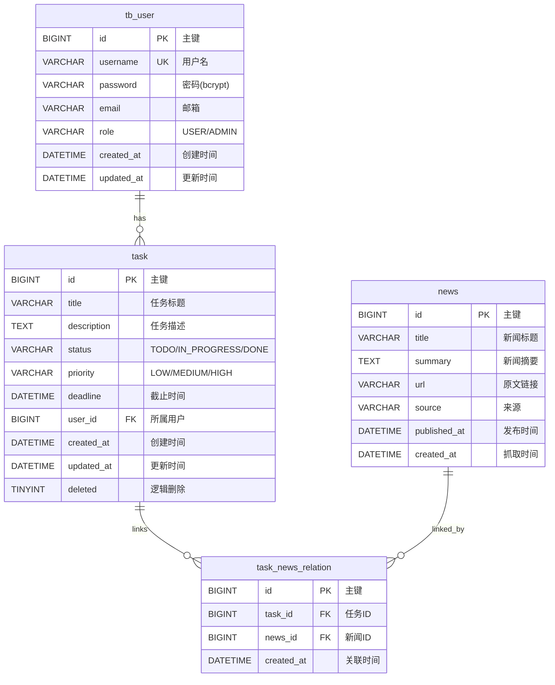

# 任务管理系统 — 设计文档

> **作者:** Peng Shanchao | **周期:** 48小时 MVP | **日期:** 2026-05-17

---

## 1. 系统架构

```
┌─────────────────────────────────────────────────────────┐
│                    浏览器 (Browser)                      │
│           Vue 3 + Element Plus + ECharts                │
│                 localhost:5173                          │
└─────────────────────┬───────────────────────────────────┘
                      │ HTTP /api/*
                      ▼
┌─────────────────────────────────────────────────────────┐
│               Nginx / Vite Proxy (:5173 → :8081)        │
└─────────────────────┬───────────────────────────────────┘
                      │
                      ▼
┌─────────────────────────────────────────────────────────┐
│              Spring Boot 3.4.5 (Java 17)                 │
│                    localhost:8081                        │
│  ┌──────────┐  ┌──────────┐  ┌────────────────────┐    │
│  │  JWT     │  │  CORS    │  │  GlobalException   │    │
│  │  Filter  │  │  Config  │  │  @ControllerAdvice │    │
│  └──────────┘  └──────────┘  └────────────────────┘    │
│  ┌──────────────────────────────────────────────────┐  │
│  │              Controller Layer (6个)               │  │
│  │  Auth / Task / News / Dashboard / Export / User  │  │
│  └────────────────────┬─────────────────────────────┘  │
│                       ▼                                 │
│  ┌──────────────────────────────────────────────────┐  │
│  │              Service Layer                        │  │
│  │  接口 + Impl（业务逻辑、RBAC 权限校验）            │  │
│  └────────────────────┬─────────────────────────────┘  │
│                       ▼                                 │
│  ┌──────────────────────────────────────────────────┐  │
│  │       MyBatis-Plus Mapper (数据访问)              │  │
│  │  分页插件 / 逻辑删除 / 自动填充                    │  │
│  └────────────────────┬─────────────────────────────┘  │
└───────────────────────┼─────────────────────────────────┘
                        │
                        ▼
┌─────────────────────────────────────────────────────────┐
│                 MySQL 8.0.37 (taskdb)                    │
│  tb_user │ task │ news │ task_news_relation             │
└─────────────────────────────────────────────────────────┘
```

### 技术栈

| 层级 | 技术 | 版本 |
|------|------|------|
| 后端框架 | Spring Boot | 3.4.5 |
| ORM | MyBatis-Plus | 3.5.5 |
| 安全 | Spring Security + JWT (jjwt) | 0.12.6 |
| 数据库 | MySQL (prod) / H2 (dev) | 8.0.37 / 2.3.232 |
| 连接池 | HikariCP | 5.1.0 |
| 前端框架 | Vue 3 (Composition API) | 3.5.13 |
| 构建工具 | Vite | 6.3.5 |
| UI 库 | Element Plus | 2.10.2 |
| 图表 | ECharts | 5.6.0 |
| 状态管理 | Pinia | 2.3.1 |
| HTTP 客户端 | Axios | 1.9.0 |

---

## 2. 数据库设计

### ER 图



### 表关系说明

| 关系 | 类型 | 说明 |
|------|------|------|
| tb_user → task | 1:N | 一个用户拥有多个任务 |
| task → task_news_relation | 1:N | 一个任务可关联多个新闻 |
| news → task_news_relation | 1:N | 一条新闻可被多个任务关联 |

---

## 3. API 接口设计

所有接口统一响应格式：`{ code: number, message: string, data: T }`

### 3.1 认证 — `/api/auth`

| 方法 | 路径 | 说明 | 认证 |
|------|------|------|------|
| POST | `/api/auth/login` | 用户登录，返回 JWT | 否 |
| POST | `/api/auth/register` | 用户注册 | 否 |

**请求示例：**
```json
POST /api/auth/login
{ "username": "your-username", "password": "your-password" }

→ { "code": 200, "data": { "token": "eyJ...", "username": "admin", "role": "ADMIN" } }
```

### 3.2 任务 — `/api/tasks`

| 方法 | 路径 | 说明 | 认证 |
|------|------|------|------|
| GET | `/api/tasks` | 分页列表（支持 status/priority/keyword 筛选） | 是 |
| GET | `/api/tasks/{id}` | 任务详情 | 是 |
| POST | `/api/tasks` | 创建任务 | 是 |
| PUT | `/api/tasks/{id}` | 更新任务 | 是 |
| DELETE | `/api/tasks/{id}` | 删除任务（逻辑删除） | 是 |
| GET | `/api/tasks/{id}/news` | 获取任务关联的新闻 | 是 |
| POST | `/api/tasks/{id}/news/{newsId}` | 关联新闻到任务 | 是 |
| DELETE | `/api/tasks/{id}/news/{newsId}` | 取消关联 | 是 |

### 3.3 新闻 — `/api/news`

| 方法 | 路径 | 说明 | 认证 |
|------|------|------|------|
| GET | `/api/news` | 新闻列表（分页 + source/keyword 筛选） | 是 |
| GET | `/api/news/search` | 按关键字搜索 | 是 |
| GET | `/api/news/sources` | 获取所有来源（用于下拉筛选） | 是 |
| GET | `/api/news/related` | 获取与当前用户任务相关的新闻 | 是 |
| POST | `/api/news/refresh` | 手动触发 RSS 抓取 | 是 |

### 3.4 仪表盘 — `/api/dashboard`

| 方法 | 路径 | 说明 | 认证 |
|------|------|------|------|
| GET | `/api/dashboard/stats` | 当前用户任务统计 | 是 |

**响应示例：**
```json
{
  "totalTasks": 25,
  "todoCount": 8,
  "inProgressCount": 12,
  "doneCount": 5,
  "highPriorityCount": 3,
  "overdueCount": 2,
  "completionRate": 20.0
}
```

### 3.5 导出 — `/api/export`

| 方法 | 路径 | 说明 | 认证 |
|------|------|------|------|
| GET | `/api/export/tasks?format=csv` | 导出 CSV（管理员导出全部） | 是 |
| GET | `/api/export/tasks?format=xlsx` | 导出 Excel | 是 |

---

## 4. 技术选型理由

| 选型 | 理由 |
|------|------|
| **Spring Boot 3.4** | 生态成熟，Java 17+ 虚拟线程友好，内置 Tomcat |
| **MyBatis-Plus** | 相比 JPA 更灵活，自带分页/逻辑删除/自动填充，适合快速开发 |
| **JWT 无状态认证** | 无需服务端 Session，适合前后端分离，部署方便 |
| **Vue 3 Composition API** | 比 Options API 更灵活，`<script setup>` 语法简洁 |
| **Element Plus** | 中文生态好，组件丰富，适合管理后台 |
| **H2 (dev) / MySQL (prod)** | H2 零配置适合开发，MySQL 8.0.37 适合生产 |
| **RSS (Rome)** | 技术新闻自动抓取，无需第三方新闻 API |

---

## 5. AI 工具使用心得

### 使用的 AI 工具

| 工具 | 用途 | 占比 |
|------|------|------|
| **Claude Code** | 主力编码、调试、代码审查、架构设计、Bug 修复 | ~50% |
| **ChatGPT** | 辅助问答、技术方案讨论、RSS 抓取方案选型 | ~25% |
| **DeepSeek** | 中文场景优化、文档生成、SQL 脚本校验 | ~15% |
| **GitHub Copilot** | IDE 内代码补全、模板生成、单元测试骨架 | ~10% |

### AI 代码验证策略

1. **API 契约一致性**：前后端字段名必须对齐，AI 生成的 DTO 字段需逐行对比（如 `todoCount` vs `todo_count`）
2. **安全审计**：JWT 密钥不进仓库、密码 bcrypt 加密、RBAC 权限校验不可遗漏、SQL 注入检查
3. **空值处理**：后端返回必做 null 检查，前端 `?.` 可选链防护，`LocalDateTime` 序列化检查
4. **启动验证**：每次 AI 生成后端代码后立即 `mvn spring-boot:run` 验证，发现连接/配置问题立刻修复
5. **前后端联动测试**：前端页面逐个功能点验证，确保 API 返回数据能正确渲染

### 开发过程中踩过的坑（5月15日—17日）

---

**坑 1：表名 `user` 与 MySQL 关键字冲突（5月15日）**

- **现象：** MyBatis-Plus 执行 SQL 时报语法错误，`user` 被 MySQL 解析为保留字
- **原因：** `user` 是 MySQL 8.0 关键字，不加反引号会导致 SQL 解析失败
- **解决：** 表名改为 `tb_user`，实体类加 `@TableName("tb_user")`
- **教训：** 数据表命名时应避免数据库保留字，AI 通常不会主动提醒这一点

```sql
-- 错误
CREATE TABLE user (...);
-- 修复
CREATE TABLE `tb_user` (...);
```

---

**坑 2：H2 开发环境与 MySQL 生产环境 SQL 差异（5月16日）**

- **现象：** 本地 H2 能启动，切换到 MySQL 后部分 SQL 语法不支持
- **原因：** H2 的 `MODE=MySQL` 只模拟部分语法，`ON UPDATE CURRENT_TIMESTAMP`、`TINYINT(1)` 等在 MySQL 和 H2 中行为不同
- **解决：** 采用 Spring Profile 分离配置：
  - `dev` profile：H2 内存数据库 + `schema.sql` 自动建表
  - `prod` profile：MySQL + 独立的 `mysql-schema.sql` 手工执行
- **教训：** 开发环境和生产环境数据库必须尽早对齐，不能在开发最后一天才切换

---

**坑 3：AI 生成的中文异常消息与项目规范冲突（5月16日）**

- **现象：** `AuthServiceImpl.java` 中登录失败的异常消息是中文（"用户未注册，请先注册"），而 CLAUDE.md 规定所有代码必须英文
- **原因：** AI（DeepSeek）默认以中文语境生成用户提示消息，未检查项目规范
- **解决：** 改为英文消息并统一在 `GlobalExceptionHandler` 中处理异常映射
- **教训：** AI 在多语言场景下容易忽略项目规范，必须有明确的检查清单

```java
// AI 生成（中文，不合规）
throw new BadCredentialsException("用户未注册，请先注册");

// 应改为英文
throw new BadCredentialsException("User not found or invalid credentials");
```

---

**坑 4：MySQL 8.0.37 连接报 `Public Key Retrieval is not allowed`（5月17日）**

- **现象：** 项目启动成功，但首次执行数据库查询时 HikariCP 连接池报错，所有定时任务（RSS 抓取）失败
- **完整错误链路：**
  1. Spring Boot 启动成功（HikariCP 延迟连接）
  2. `NewsServiceImpl.refreshNews()` 定时任务触发（`@Scheduled(fixedRate = 1800000)`，启动后约 2 秒）
  3. HikariCP 尝试建立连接 → `SQLNonTransientConnectionException: Public Key Retrieval is not allowed`
  4. 三个 RSS feed 全部失败，日志连续报错
- **原因：** MySQL 8.0.37 默认 `caching_sha2_password` 认证插件，JDBC 驱动 (`mysql-connector-j-9.1.0`) 要求显式允许公钥检索
- **解决：** 在 `application.yml` 的 MySQL JDBC URL 追加 `&allowPublicKeyRetrieval=true`
- **教训：** JDBC 驱动版本与数据库认证插件必须匹配，升级驱动后应验证连接

```
2026-05-17T09:51:59.466+08:00 ERROR --- [scheduling-1] c.t.s.i.NewsServiceImpl :
  Failed to fetch RSS feed: https://www.oschina.net/news/rss
Caused by: com.mysql.cj.exceptions.UnableToConnectException: 
    Public Key Retrieval is not allowed
    at CachingSha2PasswordPlugin.nextAuthenticationStep(...)

# 修复前
url: jdbc:mysql://localhost:3306/taskdb?sslMode=DISABLED&serverTimezone=Asia/Shanghai
# 修复后
url: jdbc:mysql://localhost:3306/taskdb?sslMode=DISABLED&serverTimezone=Asia/Shanghai&allowPublicKeyRetrieval=true
```

---

**坑 5：技术新闻 Source 下拉框始终为空（5月17日）**

- **现象：** Tech News 页面的 Source 筛选下拉框没有任何选项，切换分页或搜索均无法填充
- **排查过程：**
  1. 检查 Element Plus 的 `el-select` 绑定 — 正常
  2. 检查 `sources` 响应式变量 — 始终为空数组 `[]`
  3. 定位到 `fetchNews()` 中（`NewsView.vue:87-88`）：`const srcSet = new Set(sources.value)` 创建了 Set，往里加了数据，但**从未赋值回 `sources.value`** — AI 生成的典型半成品代码
  4. 进一步分析发现即使修复赋值，也只能获取当前分页的 source，换页后列表不完整
  5. 确认后端没有任何获取所有来源的 API
- **解决：** 
  - 后端三层新增：Mapper → Service → Controller，执行 `SELECT DISTINCT source FROM news`
  - 前端新增 `fetchSources()` 函数，在页面挂载和手动刷新时调用
  - 删除原有的无效 Set 收集逻辑
- **教训：** AI 生成代码有三类常犯错误：①创建变量忘记赋值 ②逻辑不完整（只考虑当前页未考虑全局）③前后端职责划分不清

```javascript
// AI 生成的错误代码 — NewsView.vue 第87-88行
const srcSet = new Set(sources.value)
newsList.value.forEach(n => { if (n.source) srcSet.add(n.source) })
// ↑ 缺少: sources.value = [...srcSet]

// 修复方案 — 调用独立的后端接口
async function fetchSources() {
  const res = await newsApi.sources()
  sources.value = res.data || []
}
```

---

**坑 6：TaskDialog 详情/编辑模式判断逻辑脆弱（5月16日）**

- **现象：** 编辑任务时偶尔切换到"只读详情"模式，无法修改
- **原因：** `TaskDialog.vue` 第 134 行用 `if (!task.title) viewOnly.value = true` 判断查看模式 — title 为空不代表是查看操作，会误判标题为空的编辑场景
- **解决：** 调用方（TaskListView）通过 `showCreateDialog`、`showDetail`、`editTask` 三个独立方法区分场景，规避组件内部的脆弱判断
- **教训：** AI 对状态管理类逻辑容易给出"刚好能用但不健壮"的方案，此类代码应标记为技术债务

```javascript
// AI 生成的脆弱判断 (TaskDialog.vue)
if (!task.title) {
  viewOnly.value = true  // 标题为空 ≠ 查看模式
}

// 理想方案（待重构）
function open(task, mode = 'edit') {
  viewOnly.value = (mode === 'view')
}
```

---

## 6. 遇到的问题及解决思路

### 问题总览（5月15日—17日）

| # | 日期 | 问题 | 严重程度 | 状态 |
|---|------|------|----------|------|
| 1 | 5/15 | 表名 `user` 与 MySQL 关键字冲突 | 🟡 中断 | ✅ 已解决 |
| 2 | 5/16 | H2 与 MySQL SQL 语法不兼容 | 🔴 阻塞 | ✅ 已解决 |
| 3 | 5/16 | AI 生成中文异常消息违反项目规范 | 🟢 轻微 | ✅ 已解决 |
| 4 | 5/16 | TaskDialog 编辑/查看模式判断不健壮 | 🟡 体验 | ⚠️ 技术债 |
| 5 | 5/17 | MySQL Public Key Retrieval 连接失败 | 🔴 阻塞 | ✅ 已解决 |
| 6 | 5/17 | Source 下拉框数据为空 | 🟡 功能缺失 | ✅ 已解决 |
| 7 | 5/17 | RSS 源访问不稳定（国内网络） | 🟡 体验 | ⚠️ 待优化 |

---

### 问题 1：表名与 MySQL 关键字冲突

**现象：** MyBatis-Plus 启动时执行 DDL 报 SQL 语法错误。

**根本原因：** 最初设计的表名 `user` 是 MySQL 8.0 保留关键字，不加反引号会导致 SQL 解析失败。

**解决思路：** 表名改为 `tb_user`，实体类加 `@TableName("tb_user")` 显式映射。项目初期做此修改成本很低。

---

### 问题 2：H2 与 MySQL SQL 语法差异

**现象：** H2 dev 环境测试通过的功能，切换到 MySQL prod 后部分查询报错。

**根本原因：** H2 的 `MODE=MySQL` 模拟不完整，以下语法存在差异：
- `ON UPDATE CURRENT_TIMESTAMP` — H2 不支持
- `TINYINT(1)` — H2 映射为 `BOOLEAN`
- 字符集/排序规则 — H2 无对应概念

**解决思路：**
1. 使用 Spring Profile 分离 dev/prod 配置（`application.yml` 中使用 `---` 分隔）
2. dev 环境使用 H2 内存数据库 + `schema.sql` 自动初始化
3. prod 环境使用独立 `mysql-schema.sql`，手动执行建库建表
4. 所有增删改查使用 MyBatis-Plus Lambda 查询，避免手写 SQL 的环境差异

---

### 问题 3：AI 生成中文异常消息

**现象：** `AuthServiceImpl.java` 中 `BadCredentialsException` 的消息为中文，与项目 English-only 规范冲突。

**解决思路：** 将异常消息改为英文，由前端 Axios 拦截器统一处理错误提示的展示。在 `GlobalExceptionHandler` 中集中管理异常到 HTTP 状态码的映射。

---

### 问题 4：TaskDialog 模式判断不健壮

**现象与原因见第五章坑 6。**

**当前措施：** 调用方（TaskListView）明确区分 `showCreateDialog`、`showDetail`、`editTask` 三种场景，避免依赖组件内部的脆弱判断。

**待重构：** 将 `open()` 改为接收显式 mode 参数。

---

### 问题 5：MySQL Public Key Retrieval 连接失败

**现象（关键日志）：**
```
2026-05-17T09:51:59.466+08:00 ERROR --- [scheduling-1] c.t.s.i.NewsServiceImpl :
  Failed to fetch RSS feed: https://www.oschina.net/news/rss
Caused by: java.sql.SQLNonTransientConnectionException: 
    Public Key Retrieval is not allowed
Caused by: com.mysql.cj.exceptions.UnableToConnectException: 
    Public Key Retrieval is not allowed
    at CachingSha2PasswordPlugin.nextAuthenticationStep(...)
```

**错误链路追踪：**
```
@Scheduled(fixedRate = 30min)
    ↓
NewsServiceImpl.refreshNews()
    ↓
newsMapper.selectByUrl(link)   ← 第一次数据库查询
    ↓
HikariCP 尝试获取连接
    ↓
MySQL JDBC Driver 认证握手
    ↓
caching_sha2_password → 需要公钥 → 驱动拒绝 ❌
```

**根本原因：** MySQL 8.0.37 弃用 `mysql_native_password`，默认使用 `caching_sha2_password`，而 JDBC 驱动 `mysql-connector-j-9.1.0` 出于安全考虑默认 `allowPublicKeyRetrieval=false`。

**方案对比：**

| 方案 | 操作 | 优点 | 缺点 |
|------|------|------|------|
| A（采用） | JDBC URL 加 `allowPublicKeyRetrieval=true` | 应用层修改，不改数据库 | 理论上略微降低安全性 |
| B | `ALTER USER 'root'@'localhost' IDENTIFIED WITH mysql_native_password BY 'root'` | 更贴近 5.x 兼容模式 | 需数据库权限，降低认证强度 |

选择方案 A 的原因：改动范围最小，不侵入数据库配置，且开发环境安全性要求不高。

---

### 问题 6：Source 下拉框无数据

**现象：** 页面 Source 筛选下拉框始终为空白，所有用户受影响。

**根因分析（双重缺陷）：**

| 层级 | 问题 | 代码位置 |
|------|------|----------|
| 前端 | `sources` Set 收集后未赋值 | `NewsView.vue:87-88` |
| 后端 | 缺少获取所有来源的 API | 无对应接口 |

**解决方案：**

| 层级 | 修改 | 文件 |
|------|------|------|
| Mapper | 新增 `selectDistinctSources()` | `NewsMapper.java` |
| Service | 新增 `getSources()` 接口及实现 | `NewsService.java` / `NewsServiceImpl.java` |
| Controller | 新增 `GET /api/news/sources` | `NewsController.java` |
| API 层 | 新增 `sources()` 封装 | `newsApi.js` |
| 视图层 | 新增 `fetchSources()`，挂载和刷新时调用 | `NewsView.vue` |

**修复验证：** 启动后端 → 调用 `/api/news/sources` → 确认返回 JSON 数组 → 前端下拉框正常显示。

---

### 问题 7：RSS 源抓取不稳定

**现象：** 三个 RSS 源（oschina.net、infoq.cn、36kr.com）定时抓取时频繁超时，导致新闻表（`news`）长时间无新增数据。

**日志证据：**
```
2026-05-17T09:51:59.466+08:00 ERROR --- [scheduling-1] c.t.s.i.NewsServiceImpl :
  Failed to fetch RSS feed: https://www.oschina.net/news/rss
2026-05-17T09:52:00.805+08:00 ERROR --- [scheduling-1] c.t.s.i.NewsServiceImpl :
  Failed to fetch RSS feed: https://www.infoq.cn/feed
2026-05-17T09:52:14.268+08:00 ERROR --- [scheduling-1] c.t.s.i.NewsServiceImpl :
  Failed to fetch RSS feed: https://36kr.com/feed
```

**当前措施：**
- 每个 RSS 源独立 `try-catch`，单个失败不影响其他源
- 设置连接和读取超时 10 秒（`HttpURLConnection.setConnectTimeout/ReadTimeout`）
- 设置 User-Agent 模拟浏览器请求，避免被反爬拦截
- 提供手动触发刷新接口 `POST /api/news/refresh`

**后续优化方向：**
- 增加备用 RSS 源（如 Hacker News、Dev.to、Reddit programming）
- 支持用户自定义添加 RSS 源
- 加入指数退避重试机制（1min → 2min → 4min...）
- 考虑引入 WebSocket 推送刷新结果，而非轮询等待

---

> **注：** 数据库建表脚本见 `docs/mysql-schema.sql`
